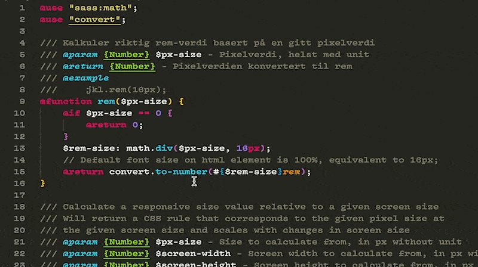
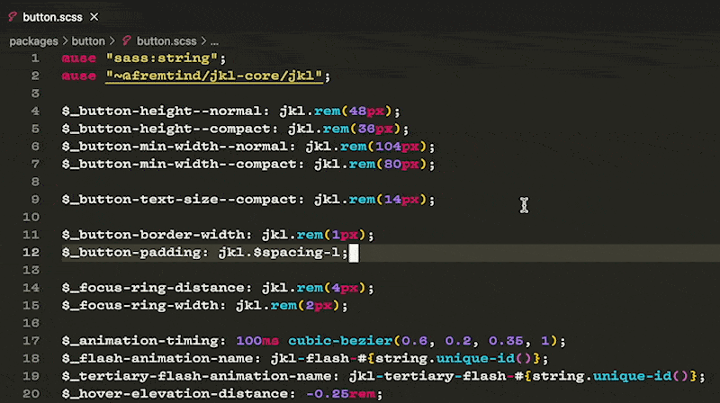
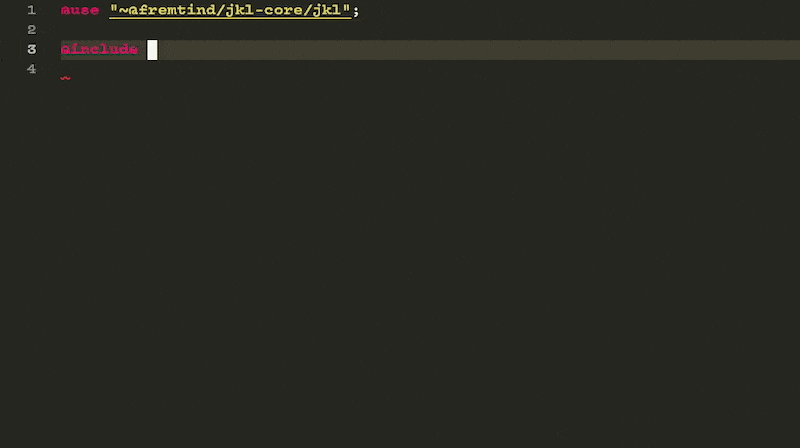

# Some Sass for Visual Studio Code

Some Sass provides autocompletion and refactoring for SCSS, with rich documentation through [SassDoc](http://sassdoc.com). Supports standalone SCSS, as well as style blocks inside Vue and Svelte components.

Based on SCSS Intellisense by [Denis Malinochkin and contributors](https://github.com/mrmlnc/vscode-scss). Uses the built-in VS Code language server for SCSS.

## Setup

Search for Some Sass (`SomewhatStationery.some-sass`) from the extension installer within VS Code or install from [the Marketplace](https://marketplace.visualstudio.com/items?itemName=SomewhatStationery.some-sass).

If you have SCSS IntelliSense (`mrmlnc.vscode-scss`) installed you should disable or uninstall it. Otherwise the two extensions will both provide hover information and code suggestions.

## Usage

### Information on hover

Hover over any Sass variables, mixins or functions to see more details about them.

Documentation written with SassDoc will be included in the hover information. Additionally, the extension will provide (~~strikethrough~~) hints when using something marked as `@deprecated` [with SassDoc](http://sassdoc.com/annotations/#deprecated).



### Go to definition

To use this feature, either:

- Hold down `Cmd` and click a variable, mixin or function
- Right-click a variable, mixin or function and choose `Go to Definition`
- Press `F12` when the cursor is at a variable, mixin or function

#### Go to Symbol

In the `Go` menu, choose either `Go to Symbol in Workspace` (`Cmd + Shift + R`) or `Go to Symbol in Editor` (`Cmd + R`) to use this feature.



### Code suggestions

The extension will suggest variables, mixins and functions as you type.

For mixins and functions the extension will help you with signature information as you type.

If you document your mixin using the `@content` [annotation from SassDoc](http://sassdoc.com/annotations/#content) the extension will use that information to autosuggest brackets and move focus inside the mixin contents.



## Settings


| Name | Default | Type | Description |
|------|---------|------|-------------|
| scannerDepth | 30 | `number` | The maximum number of nested directories to scan. |
| scannerExclude | `["**/.git", "**/node_modules", "**/bower_components"]` | `string[]` | List of [glob](https://github.com/mrmlnc/fast-glob) patterns for directories that are excluded when scanning. |
| scanImportedFiles | `true` | `boolean` | Allows scan imported files. |
| showErrors | `false` | `boolean` | Allows to display parsing errors from the internal scanner. |
| suggestVariables | `true` | `boolean` | Include variables in suggestions. |
| suggestMixins | `true` | `boolean` | Include mixins in suggestions. |
| suggestFunctions | `true` | `boolean` | Include functions in suggestions. |
| suggestFunctionsInStringContextAfterSymbols | ` (+-*%` | `string` | Suggest functions after the specified symbols when in a string context. For example, if you add the `/` symbol to this setting, then `background: url(images/he|)` could suggest a `hello()` function. |

In JSON, all settings should be prefixed with `somesass.`, for instance `somesass.maxDepth`.

## Recommended settings

```jsonc
{
  // When providing code suggestions under namespaces (`@use "~namespace"`, then typing `namespace.$`)
  // you may see the default word-based suggestions appear again. VS Code seems to think of `$` as a
  // new fresh start for suggestions, so it will start matching any variable in the current document.
  // I'm trying to figure out a workaround that does _not_ involve tweaking default settings in VS Code,
  // but for now the best experience is had with word based suggestions turned off.
  "editor.wordBasedSuggestions": false
}
```

## What this extension does _not_ do

- Formating. Consider using [Prettier](https://marketplace.visualstudio.com/items?itemName=esbenp.prettier-vscode) if you want automatic formating.
- Linting. Consider using [Stylelint](https://marketplace.visualstudio.com/items?itemName=stylelint.vscode-stylelint) if you want a linter that supports SCSS.
- Compiling. If you want VS Code to compile SCSS for you, consider [Live Sass Compiler](https://marketplace.visualstudio.com/items?itemName=glenn2223.live-sass).
- Support Sass Indented. See the [Sass](https://marketplace.visualstudio.com/items?itemName=Syler.sass-indented) extension if you use indented syntax.

## Changelog

Visit the [release section on GitHub](https://github.com/wkillerud/vscode-scss/releases) to see what has changed.

## License

This software is released under the terms of the MIT license.

The logo is [owned by the Sass](https://sass-lang.com/styleguide/brand) project and licensed under a Creative Commons Attribution-NonCommercial-ShareAlike 3.0 Unported License.
